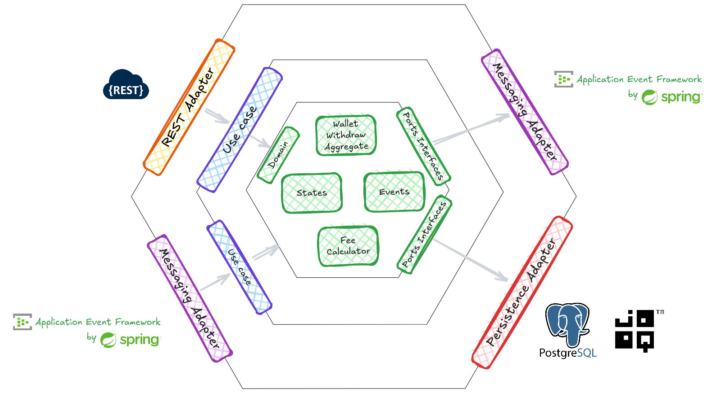
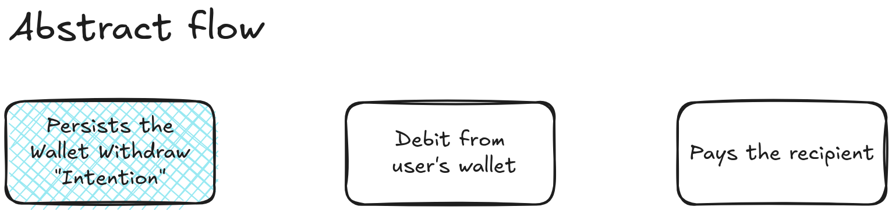
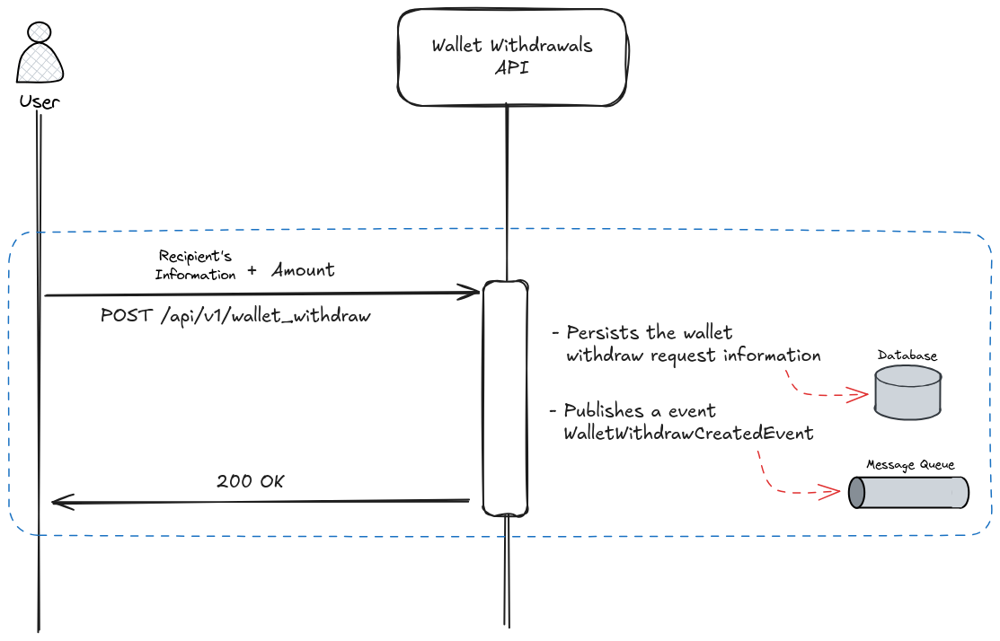
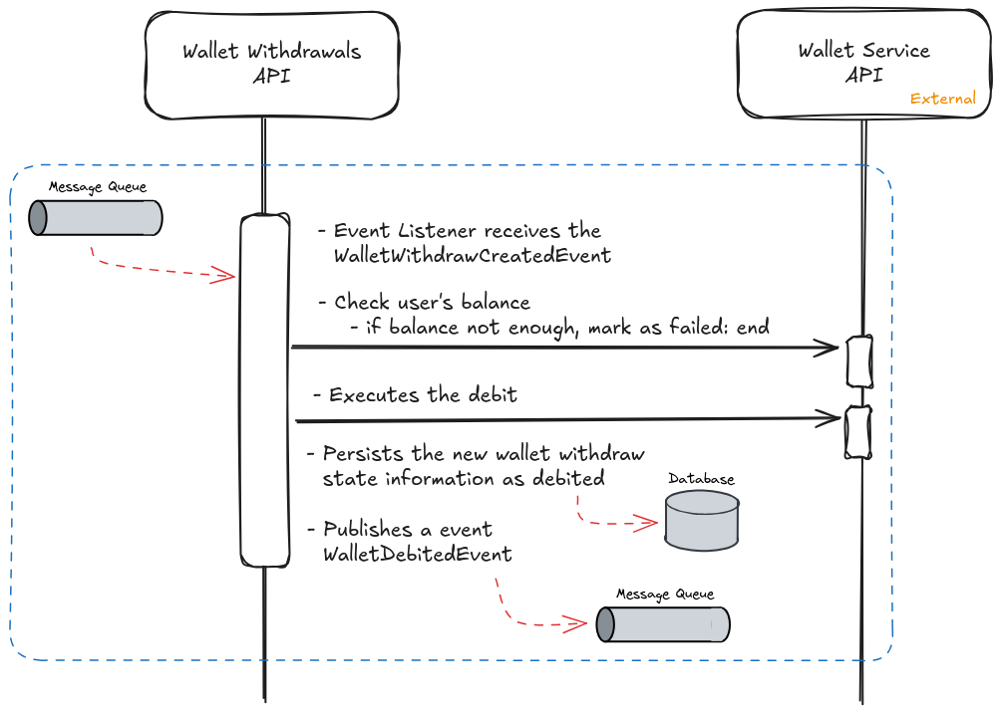
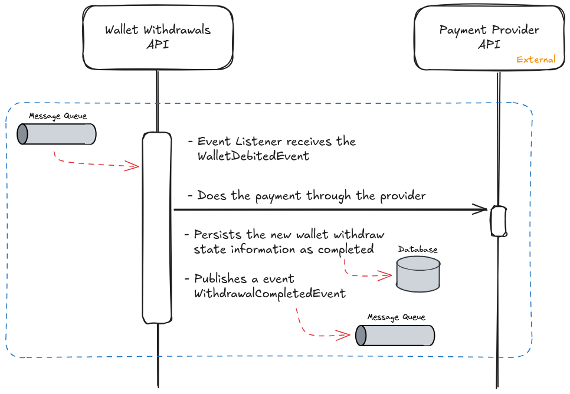

# Wallet Withdrawals Service

A Java project that simulates wallet withdrawal operations using a hexagonal architecture.  
It is split into three modules: **domain**, **application**, and **infrastructure**.

---

## Project setup

**Technologies used**
- Java 21  
- Spring Boot 3.5.5  
- PostgreSQL with jOOQ  
- Flyway for database migrations  
- JUnit 5, Mockito, Testcontainers, WireMock, RestAssured  
- Docker Compose for local setup

**Structure**
```
domain/          → business logic and entities
application/     → use cases and input ports
infrastructure/  → REST API, database, Spring configuration
```




**Design choices**
- Hexagonal architecture to keep business logic independent from frameworks.
- jOOQ for type-safe SQL generation based on migration scripts.
- Domain events for internal communication.
- Transactional event publishing to keep database and event states consistent.


---

## Architecture



The wallet withdrawal system implements a saga pattern to handle the complex process of withdrawing money from a user's wallet through an external payment provider. The system ensures atomicity and provides compensation mechanisms for failed operations, distinguishing between pre-debit failures and post-debit failures that require refunds.

### Summary

- You Start the Withdrawal: You request to withdraw a specific amount and say where it should go.

- The System Checks Your Wallet: It adds a service fee to your amount and checks your wallet for the total (withdrawal + fee).

  - If funds are low: The withdrawal is immediately marked as "Failed" and nothing else happens.

  - If funds are OK: The system takes the full total (your withdrawal + the fee) from your wallet.

- The System Makes the Payment: It tells an external payment provider to send your original withdrawal amount (without the fee) to your recipient.

  - If the payment succeeds: The provider confirms it, and your withdrawal is marked "Completed."

  - If the payment fails: The system automatically tries to put the entire amount (your withdrawal + the fee) back into your wallet. If this refund works, it's marked "Refunded." If the refund fails, it's flagged for a human to review and fix manually.

### Registering the wallet withdraw intention




### Executing the user’s wallet withdraw




### Paying the recipient



---

### More docs

- Database design: [link](docs/database.md)
- Solution for Accounts Management: [link](docs/account_management.md)
- Solution for Transaction History: [link](docs/transaction_history.md)
- Tracing: [link](docs/tracing_solution.md)

---

## How to run locally

1. **Start dependencies**
```bash
   docker compose up -d
```

2. **Build and generate code**

```bash
./gradlew clean build
   ```

3. **Run the application**

```bash
./gradlew :infrastructure:bootRun
```

The API will be available at:

```
http://localhost:8080
```

---

## How to test the endpoint

Create a withdrawal:

```bash
curl -X POST http://localhost:8080/api/v1/wallet_withdraw \
  -H "Content-Type: application/json" \
  -d '{
        "userId": 1,
        "amount": 100.00,
        "recipientFirstName": "John",
        "recipientLastName": "Doe",
        "recipientRoutingNumber": "123456789",
        "recipientNationalId": "12345678901",
        "recipientAccountNumber": "987654321"
      }'
```

Example response:

```json
{
  "transactionId": "uuid",
  "status": "CREATED",
  "createdAt": "2025-10-25T10:00:00Z"
}
```

Check the withdrawal:

```bash
curl http://localhost:8080/api/v1/wallet_withdraw/{id}
```
Expected response for a completed withdrawal:

```json
{
  "id": "a7b909b2-6b49-465b-9f92-cd9b7e7e1036",
  "userId": 1,
  "amount": 100.00,
  "fee": 10.00,
  "amountForRecipient": 90.00,
  "status": "COMPLETED",
  "createdAt": "2025-10-25T10:36:30.993417Z",
  "failureReason": null,
  "walletTransactionIdRef": "15014",
  "paymentProviderIdRef": "1b620a42-c686-472e-8eab-5a1e6eb5d651",
  "recipientFirstName": "John",
  "recipientLastName": "Doe",
  "recipientNationalId": "123456789",
  "recipientAccountNumber": "987654321",
  "recipientRoutingNumber": "123456789"
}
```

---

## Design decisions and trade-offs

| Decision                       | Reason                                           | Trade-off                         |
| ------------------------------ | ------------------------------------------------ | --------------------------------- |
| Hexagonal architecture         | Separation between business logic and frameworks | Adds boilerplate (ports/adapters) |
| Domain events                  | Clean decoupling between modules                 | Harder to trace execution         |
| Transactional event publishing | Ensures atomic persistence and events            | Increases transaction complexity  |
| jOOQ instead of JPA            | Full SQL control and schema safety               | Requires manual query handling    |
| Testcontainers                 | Realistic integration tests                      | Slower startup time               |

---

## Run tests

```bash
./gradlew test
```
