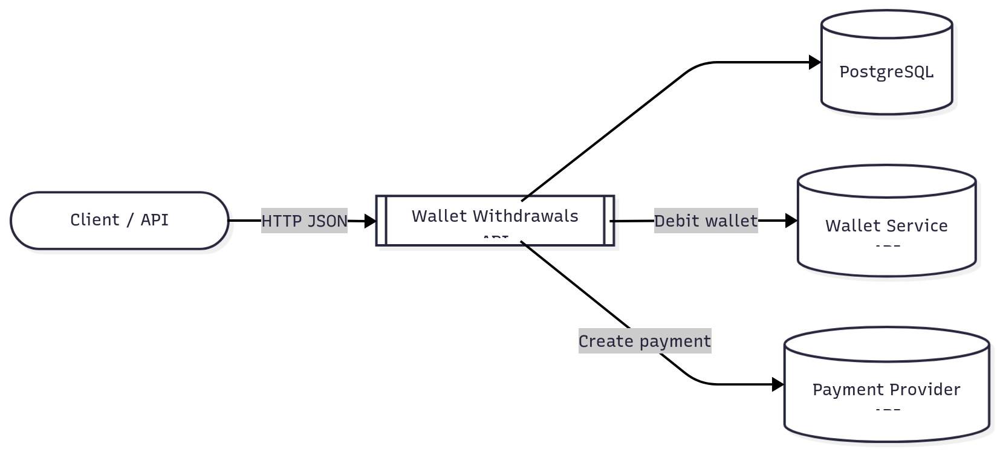
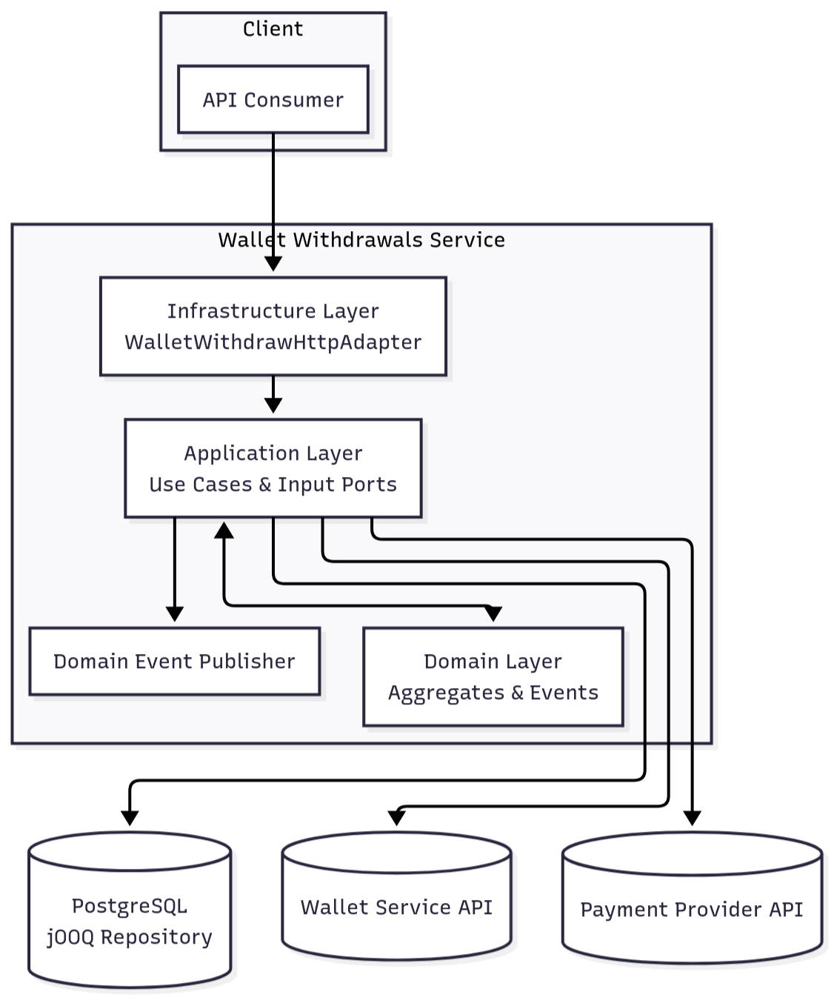
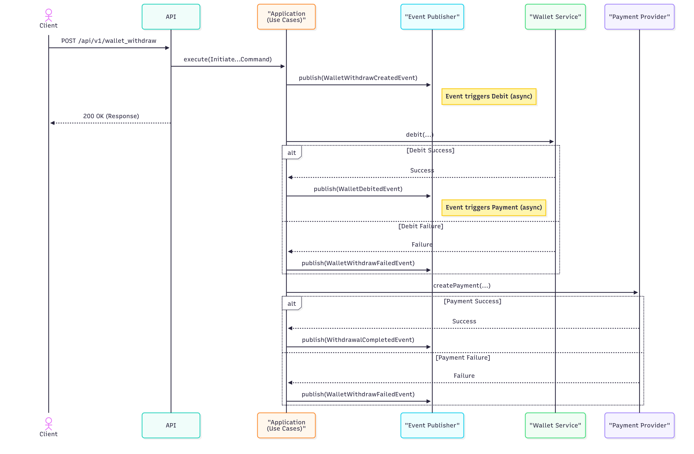

# Architecture Overview

This service follows a hexagonal architecture split into three modules: domain, application, and infrastructure. It integrates with a wallet service and a payment provider, persists state in PostgreSQL via jOOQ, and coordinates steps via domain events.

- Tech: Java 21, Spring Boot, jOOQ (PostgreSQL), Flyway, Testcontainers, WireMock
- External dependencies:
  - WALLET_SERVICE_URL (full URL to wallet debit endpoint)
  - PAYMENT_PROVIDER_URL (full URL to payment creation endpoint)
  - Payment Source (configured via env: PAYMENT_SOURCE_TYPE/NAME/ACCOUNT_NUMBER/CURRENCY/ROUTING_NUMBER)

## Context Diagram

## Container Diagram

- REST Controller: exposes endpoints under `/api/v1`.
- Application Layer: orchestrates use cases (Initiate, Get, ProcessWalletDebit, ProcessPayment).
- Domain Layer: WalletWithdraw aggregate, value objects (Recipient, Account), domain events.
- Event Publisher: publishes domain events after transaction commit.
- Persistence: jOOQ read/write adapters (repository adapter facade).
- External Systems: Wallet Service (debit) and Payment Provider (create payment).

## Request Flow (high-level)

1) POST /api/v1/wallet_withdraw
- Create WalletWithdraw (status=CREATED, fee computed)
- Persist and publish WalletWithdrawCreatedEvent
- Listener triggers ProcessWalletDebitUseCase

2) ProcessWalletDebitUseCase
- Calls Wallet Service to debit; updates status accordingly
- Publishes WalletDebitedEvent or WalletWithdrawFailedEvent

3) ProcessPaymentUseCase (on WalletDebitedEvent)
- Calls Payment Provider to create payment
- Publishes WithdrawalCompletedEvent or WalletWithdrawFailedEvent

4) GET /api/v1/wallet_withdraw/{id}
- Returns current state with amounts normalized to 2 decimals

