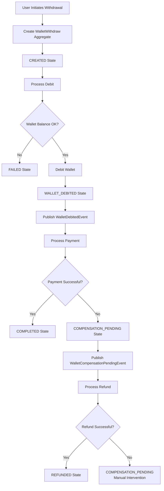

# Wallet Withdrawal Flow

## Overview

The wallet withdrawal system implements a saga pattern to handle the complex process of withdrawing money from a user's wallet through an external payment provider. The system ensures atomicity and provides compensation mechanisms for failed operations, distinguishing between pre-debit failures and post-debit failures that require refunds.

## High-Level Flow

## Detailed Flow Description

### 1. Withdrawal Creation
- User initiates withdrawal request with amount and recipient details
- System creates `WalletWithdraw` aggregate in `CREATED` state
- Fee calculation is performed (amount + fee = total debited from wallet)

### 2. Debit Processing
- System validates user's wallet balance against total amount (withdrawal + fee)
- **Failure Path**: If insufficient funds, wallet not found, or service error → marks as `FAILED`
- **Success Path**: Debits wallet via `WalletServicePort.debit()`, moves to `WALLET_DEBITED` state
- Publishes `WalletDebitedEvent` for potential rollback scenarios

### 3. Payment Processing
- System constructs payment request with recipient details and amount (withdrawal amount only, fee already deducted)
- Calls external payment provider via `PaymentProviderPort.createPayment()`
- **Success Path**: Payment confirmed → moves to `COMPLETED` state, publishes `WithdrawalCompletedEvent`
- **Failure Path**: Payment rejected or provider error → moves to `COMPENSATION_PENDING` state, publishes `WalletCompensationPendingEvent`

### 4. Compensation Processing
- `WalletCompensationPendingEventListener` receives the event
- Attempts to refund full amount (withdrawal + fee) to user's wallet via `WalletServicePort.topUp()`
- **Success Path**: Refund confirmed → calls `completeCompensation()`, moves to `REFUNDED` state, publishes `WalletRefundCompletedEvent`
- **Failure Path**: Refund fails → aggregate remains in `COMPENSATION_PENDING` state for manual intervention and monitoring alerts

## State Definitions

| State | Description | Terminal? |
|-------|-------------|-----------|
| `CREATED` | Initial state, withdrawal requested | No |
| `WALLET_DEBITED` | Wallet successfully debited, payment pending | No |
| `COMPLETED` | Payment successful, withdrawal complete | Yes |
| `FAILED` | Pre-debit failure (insufficient funds, etc.) | Yes |
| `COMPENSATION_PENDING` | Post-debit failure, refund required | No* |
| `REFUNDED` | Refund successful after failed payment | Yes |

*Note: `COMPENSATION_PENDING` is not terminal - it requires manual intervention if refund fails.

## Key Design Principles

1. **Saga Pattern**: Complex multi-step process with compensation for failures
2. **Event-Driven**: Domain events drive state transitions and side effects
3. **Resilient Compensation**: Clear distinction between different failure types
4. **Monitoring-Friendly**: `COMPENSATION_PENDING` state provides clear alerts for stuck transactions
5. **Atomic Operations**: Each step is transactional with proper rollback mechanisms

## Infrastructure Components

- **Domain Layer**: Core business logic, state machine, domain events
- **Application Layer**: Use cases, transaction boundaries, event publishing
- **Infrastructure Layer**:
  - Adapters for wallet service and payment provider
  - Event listeners for compensation logic
  - Persistence and messaging infrastructure</content>
<parameter name="filePath">/home/teixeira/code/challenges/withdrawals/docs/wallet_withdraw_flow.md